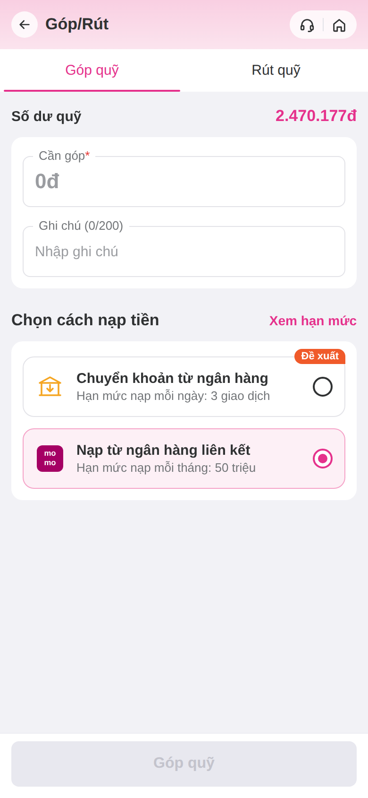
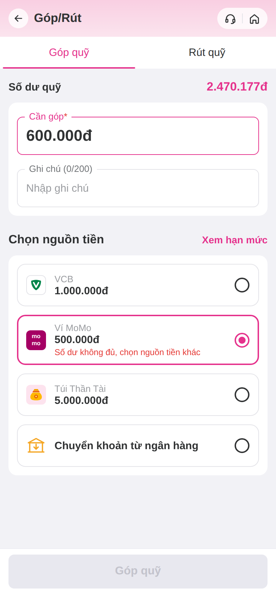
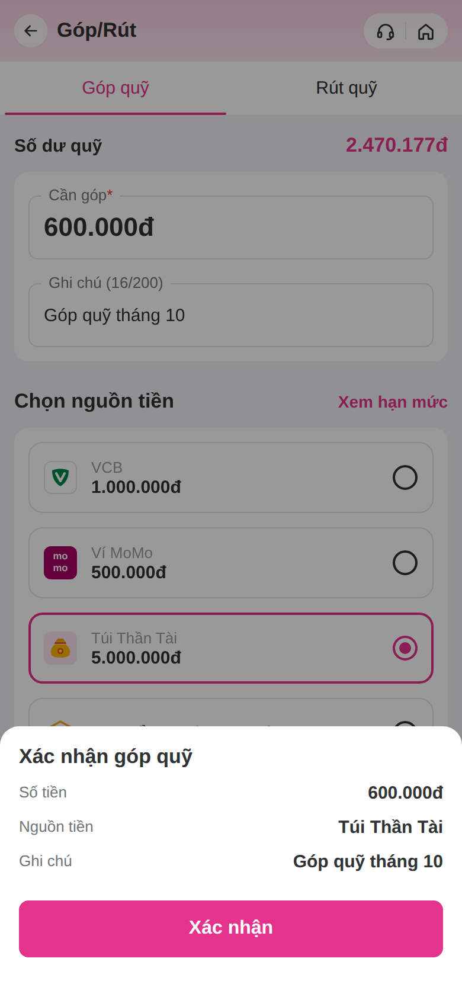
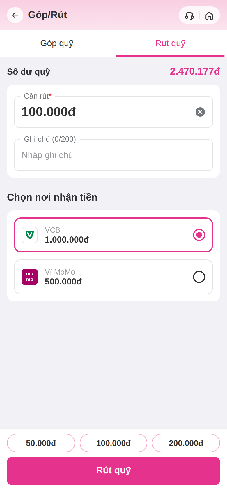
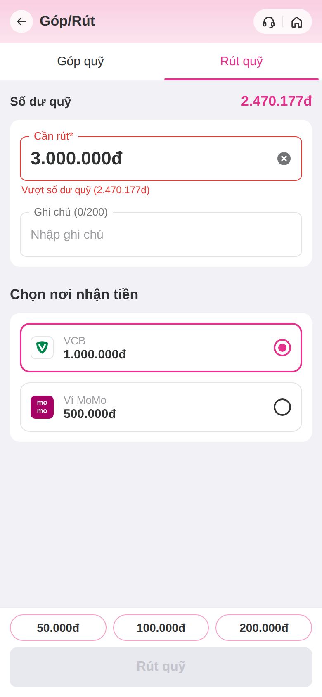
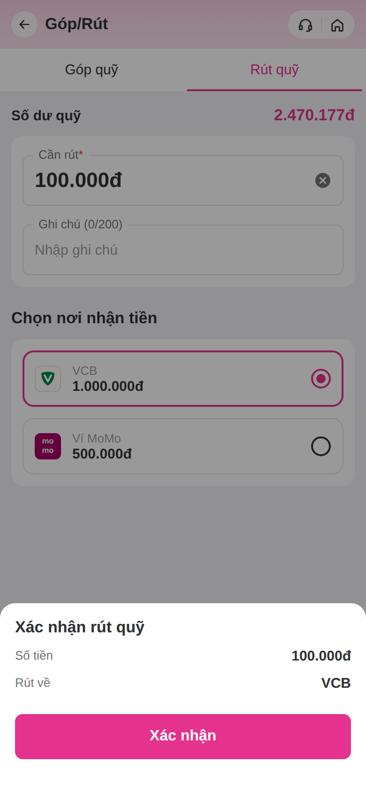
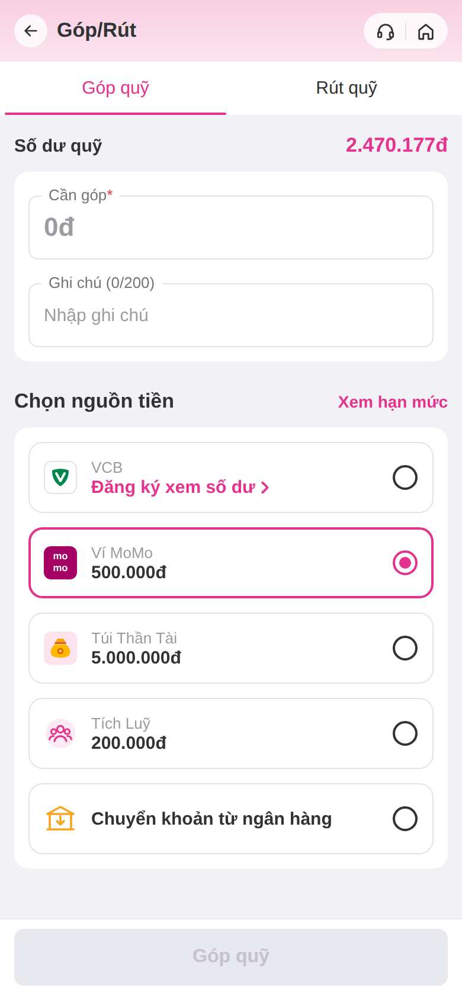
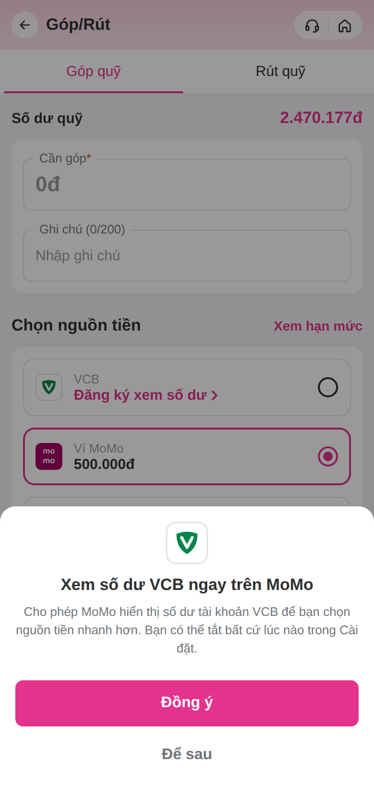
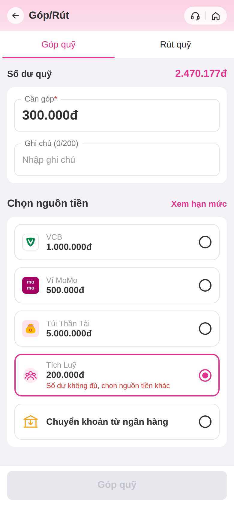

# bank-balance-prototype

Prototype màn **Góp quỹ** mới: giữ nguyên nhập số tiền + ghi chú, thêm phần **Chọn nguồn tiền** gồm VCB, Ví MoMo, Túi Thần Tài và Chuyển khoản từ ngân hàng. Nguồn có số dư sẽ báo lỗi và khoá nút khi số tiền góp vượt số dư.

Tab **Rút quỹ** dùng cùng bố cục: số dư quỹ, Cần rút, Ghi chú ở trên; **Chọn nơi nhận tiền** (VCB, Ví MoMo) ở dưới; chip số tiền nhanh trên nút Rút quỹ. Báo lỗi khi số tiền rút vượt số dư quỹ.

## Chạy thử

```bash
git clone https://github.com/chungtienminhtri-ux/bank-balance-prototype
cd bank-balance-prototype
git checkout fund-bank-balance
npm install
npx expo start --tunnel   # quét QR bằng Expo Go
# hoặc: npm run web
```

**Chia sẻ số dư ngân hàng (WS1):** mặc định VCB ở trạng thái *chưa chia sẻ số dư* → hiện "Đăng ký xem số dư ›". Bấm vào mở sheet xin phép; Đồng ý thì cả 2 tab hiện số dư VCB. Tải lại app để quay về trạng thái chưa chia sẻ. Nguồn **Tích Luỹ** (200.000đ) có ở cả Góp và Rút.

## Cấu trúc

- `src/screens/GopQuyScreen.tsx` — màn Góp/Rút, 2 tab dùng chung `FundTab` (khác biệt gom trong `MODE_CONFIG`), sheet xác nhận mock
- `src/components/` — đặt tên theo MoMo UI Kit: `TopNavigation`, `Tabs`, `InputText`, `ButtonFooter`, `FundingSourceItem`
- `src/mocks/fundingSources.ts` — mock nguồn tiền và số dư
- `src/theme.ts` — design tokens (màu, spacing, typography). **Tạm lấy theo ảnh màn hiện tại**; thay bằng variables từ MoMo UI Kit khi Figma MCP đọc được.

## Preview

| Mặc định | Không đủ số dư | Xác nhận |
|---|---|---|
|  |  |  |

| Rút quỹ | Vượt số dư quỹ | Xác nhận rút |
|---|---|---|
|  |  |  |

| VCB chưa chia sẻ số dư | Xin phép xem số dư | Góp từ Tích Luỹ |
|---|---|---|
|  |  |  |
